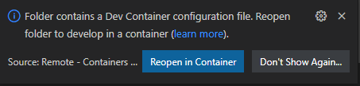

# MAT (Media Archive Tool)

Media Archive Tool project

## Introduction

This repository contains the source code of the Media Archive Tool project.
The Media Archive Tool offers the following services on Windows, MacOS and Linux:

1. List media files (Audio files, Picture files, Video files) in a folder
2. Copy/Archive media files (Audio files, Picture files, Video files) from a folder to another folder
Pictures are sorted by date, Audio files are sorted by Artist and Album, Video files are sorted by date. If the same media file has already been archived it won't be copied.

## Getting Started

### Installing the pre-requisites

In order to test the solution, you need first an Azure Subscription, you can get further information about Azure Subscription [here](https://azure.microsoft.com/en-us/free).

You also need to install Git client and Visual Studio Code on your machine, below the links.

|[](https://git-scm.com/download/win) |[](https://git-scm.com/download/linux)|[](https://git-scm.com/download/mac)|
|:---|:---|:---|
| [Git Client for Windows](https://git-scm.com/download/win) | [Git client for Linux](https://git-scm.com/download/linux)| [Git Client for MacOs](https://git-scm.com/download/mac) |
[Visual Studio Code for Windows](https://code.visualstudio.com/Download)  | [Visual Studio Code for Linux](https://code.visualstudio.com/Download)  &nbsp;| [Visual Studio Code for MacOS](https://code.visualstudio.com/Download) &nbsp; &nbsp;|

Once the Git client is installed you can clone the repository on your machine running the following commands:

1. Create a Git directory on your machine

    ```bash
        c:\> mkdir git
        c:\> cd git
        c:\git>
    ```

2. Clone the repository.  
    For instance:

    ```bash
        c:\git> git clone  https://github.com/flecoqui/mat.git 
        c:\git> cd ./mat
        c:\git\mat> 
    ```

### Using Dev Container

#### Installing Dev Container pre-requisites

You need to install the following pre-requisite on your machine

1. Install and configure [Docker](https://www.docker.com/get-started) for your operating system.

   - Windows / macOS:

     1. Install [Docker Desktop](https://www.docker.com/products/docker-desktop) for Windows/Mac.

     2. Right-click on the Docker task bar item, select Settings / Preferences and update Resources > File Sharing with any locations your source code is kept. See [tips and tricks](https://code.visualstudio.com/docs/remote/troubleshooting#_container-tips) for troubleshooting.

     3. If you are using WSL 2 on Windows, to enable the [Windows WSL 2 back-end](https://docs.docker.com/docker-for-windows/wsl/): Right-click on the Docker taskbar item and select Settings. Check Use the WSL 2 based engine and verify your distribution is enabled under Resources > WSL Integration.

   - Linux:

     1. Follow the official install [instructions for Docker CE/EE for your distribution](https://docs.docker.com/get-docker/). If you are using Docker Compose, follow the [Docker Compose directions](https://docs.docker.com/compose/install/) as well.

     2. Add your user to the docker group by using a terminal to run: 'sudo usermod -aG docker $USER'

     3. Sign out and back in again so your changes take effect.

2. Ensure [Visual Studio Code](https://code.visualstudio.com/) is already installed.

3. Install the [Remote Development extension pack](https://marketplace.visualstudio.com/items?itemName=ms-vscode-remote.vscode-remote-extensionpack)

#### Using Visual Studio Code and Dev Container

1. Launch Visual Studio Code in the folder where you cloned the 'ps-data-foundation-imv' repository

    ```bash
        c:\git\mat> code .
    ```

2. Once Visual Studio Code is launched, you should see the following dialog box:

    

3. Click on the button 'Reopen in Container'
4. Visual Studio Code opens the Dev Container. If it's the first time you open the project in container mode, it first builds the container, it can take several minutes to build the new container.
5. Once the container is loaded, you can open a new terminal (Terminal -> New Terminal).
6. And from the terminal, you have access to the tools installed in the Dev Container like az client,....

    ```bash
        vscode ➜ /workspace (main) $  
    ```

### Building and Installing the Media Archive Tool

You can build the Media Archive Tool for the following platforms:
- Windows 64 bits
- Linux 64 bits
running the following command in the dev container terminal:

    ```bash
        vscode ➜ /workspace (main) $  ./scripts/build.sh 
    ```

After few minutes, the binaries for each platform are available under releases folder:
- mat-linux-x64.tar.gz
- mat-win-x64.tar.gz

Those zip files contain the self-contained mat application.
You only need to copy and unzip the gz file on the targeted machine, and then run mat command line tool.


### Using the Media Archive Tool

Once the Media Archive Tool is copied on your machine, you can:

- List the media files to archive using this command line:

    ```cmd
        c:\mat> mat --list  [--audio] [--picture] [--video] --source [source-folder]  --destination [destination-folder] [--verbose]  
    ```

- Archive the media files 

    ```cmd
        c:\mat> mat --archive [--audio] [--picture] [--video] --source [source-folder]  --destination [destination-folder] [--year|--month|--day] [--verbose]  
    ```

- Get help information


    ```cmd
        c:\mat> mat --help 
    ```
